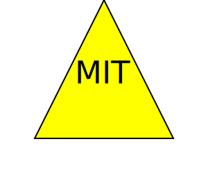

# SVG Logo Generator 

[](https://github.com/ChrisVulpine)
## Description
This is a simple SVG logo generator that runs in the CLI and allows the user to create a custom logo based on answers to prompts in the CLI. The user will be prompted to choose: 3 characters, the color of those characters, a shape from a list of three shapes, and a color for that shape. Once the questions are answered, the logo will be generated. 

## Table of Contents

- [Installation](#installation)
- [Usage](#usage)
- [Tests](#tests)
- [Examples](#examples)
- [License](#license)
- [Credits](#credits)
- [Questions](#questions)

## Installation
Clone this repository to your local device and install the dependencies using the command 

```
 npm install 
 ```

  This application uses [Jest](https://www.npmjs.com/package/jest) for testing and [Inquirer](https://www.npmjs.com/package/inquirer) for questions and tracking user answers.

## Usage
After navigating to the project in your CLI run the following command:
 ```
 node index.js 
 ```  
 Prompts will help you build your custom logo. Once all questions have been answered, the SVG logo will be generated in the examples directory. A video demo of the project can be viewed [here](https://drive.google.com/file/d/1SY8lrpmcm5pi2_GRrLRotxTadvJQrfPm/preview), and example logos are below.

## Tests
To test this application after installing dependencies run the following command in your CLI
``` 
npx jest 
``` 
## Examples

  


## Credits
* Inquirer NPM: https://www.npmjs.com/package/inquirer

* General Reference: https://www.w3schools.com/

* Readme Badge Generation: https://shields.io/

* Wikipedia on SVGs: https://en.wikipedia.org/wiki/SVG

* Mdn web docs on SVGs: https://developer.mozilla.org/en-US/docs/Web/SVG/Tutorial

* Jest NPM: https://www.npmjs.com/package/jest

* General NPM Reference: https://docs.npmjs.com/


## License
This project is covered under the [MIT](https://opensource.org/licenses/MIT) license.
  
  

## Questions
Got questions? Use the info below to contact me!<br>
GitHub: [@chrisvulpine](https://github.com/chrisvulpine/)


Email: [chrisleach1191@gmail.com](mailto:chrisleach1191@gmail.com)
